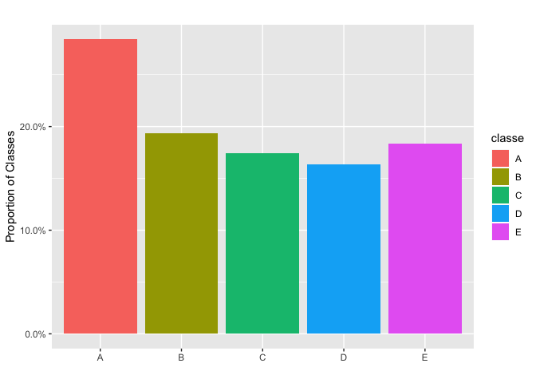
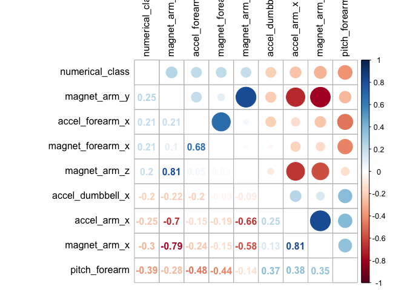

Background
==========

Using devices such as Jawbone Up, Nike FuelBand, and Fitbit it is now possible to collect a large amount of data about personal activity relatively inexpensively. These type of devices are part of the quantified self movement -a group of enthusiasts who take measurements about themselves regularly to improve their health, to find patterns in their behavior, or because they are tech geeks. One thing that people regularly do is quantify how much of a particular activity they do, but they rarely quantify how well they do it.

In this project, the goal will be to use data from accelerometers on the belt, forearm, arm, and dumbell of 6 participants. They were asked to perform barbell lifts correctly and incorrectly in 5 different ways.

The five ways are:

-   Exactly according to the specification (Class A),
-   Throwing the elbows to the front (Class B),
-   Lifting the dumbbell only halfway (Class C),
-   Lowering the dumbbell only halfway (Class D) and
-   Throwing the hips to the front (Class E).

Only Class A corresponds to correct performance.

The dataset contains information about Euler angles (roll, pitch and yaw), raw accelerometer, gyroscope and magnetometer readings for each sensor (there are four in total). For the Euler angles of each of the four sensors there were more eight features: mean, variance, standard deviation, max, min, amplitude, kurtosis and skewness, generating in total 96 derived feature sets.

The dataset is separated in training and testing set:

[Training Set](https://d396qusza40orc.cloudfront.net/predmachlearn/pml-training.csv)

[Testing Set](https://d396qusza40orc.cloudfront.net/predmachlearn/pml-testing.csv)

Exploratory Data Analysis and Preprocessing
===========================================

Reading Packages:

``` r
library(caret)
library(corrplot)
library(data.table)
library(dplyr)
library(ggplot2)
library(knitr)
library(scales)
library(summarytools)
```

Downloading and reading datasets:

``` r
# Downloading and reading training data
url <- "https://d396qusza40orc.cloudfront.net/predmachlearn/pml-training.csv"
file <- "pml-training.csv"
download.file(url, destfile = file)
train <- fread(file)

# Downloading and reading testing data
url <- "https://d396qusza40orc.cloudfront.net/predmachlearn/pml-testing.csv"
file <- "pml-testing.csv" 
download.file(url, destfile = file)
test <- fread(file)

# Checking their dimentions
dim(train)
```

    ## [1] 19622   160

``` r
dim(test)
```

    ## [1]  20 160

While the training set contains 19622 observations, the test set only 20 rows, but both datasets contain 96 variables. There are missing values that should be correctly identified:

``` r
# Training set
for (i in names(train)) {
    train[get(i) == "" | get(i) == "#DIV/0!" | get(i) == "<NA>", 
      (i) := NA]
}

# Test set
for (i in names(test)) {
    test[get(i) == "" | get(i) == "#DIV/0!" | get(i) == "<NA>", 
      (i) := NA]
}
```

We can check if the classes are well distributed:

``` r
# Plotting proportions
library(scales)
ggplot(data = train, aes(x = classe, fill = classe)) +
    geom_bar(aes(y = (..count..)/sum(..count..))) +
    scale_y_continuous(labels = percent) +
    labs(title = "", y = "Proportion of Classes", x = "")
```



From the plot, we can see that the classes are somewhat balanced.

In the model, we will perform no imputation and we will only use features with no missing values:

``` r
# Creating a data.table with the proportion of NA values for each feature
NA_columns <- data.table(names(train),
                         sapply(train, function(x) mean(is.na(x))))
NA_columns %>% head() %>% kable()
```

| V1                      |   V2|
|:------------------------|----:|
| V1                      |    0|
| user\_name              |    0|
| raw\_timestamp\_part\_1 |    0|
| raw\_timestamp\_part\_2 |    0|
| cvtd\_timestamp         |    0|
| new\_window             |    0|

``` r
# Selecting only those that have NA values
NA_columns <- NA_columns[V2 > 0, V1]

# Droping these features from the data.table
train <- select(train, -c(V1, NA_columns))
test <- select(test, -c(V1, NA_columns))
```

Showing the features that are mostly related to a correct movement performance (Class A):

``` r
# Transforming the outcome into a numerical dummy
train[, numerical_class := ifelse(classe == "A", 1, 0)]

# Correlation:
numerical_train <- select_if(train, is.numeric)
correlation <- cor(numerical_train)

# Sorting
sorted_corr <- as.matrix(sort(correlation[, "numerical_class"], decreasing = TRUE))

# Selecting only correlations with greater than 0.2 in absolute value
high_corr <- apply(sorted_corr, 1, function(x) abs(x) > 0.2)
high_corr_names <- names(which(high_corr))
correlation <- correlation[high_corr_names, high_corr_names] 

corrplot.mixed(correlation, tl.col = "black", tl.pos = "lt")
```



<!-- From the correlation analysis, we can see that 8 variables demonstrated correlation  -->
<!-- greater than 0.2 in absolute value. Let's examine the description of these variables: -->
<!-- ```{r, message=FALSE, results='asis', fig.align='center'} -->
<!-- library(summarytools) -->
<!-- descr(select(train, high_corr_names, -numerical_class),  -->
<!--       stats = c("mean", "sd", "min", "med", "max"),  -->
<!--       transpose = TRUE,  -->
<!--       omit.headings = TRUE, style = "rmarkdown") -->
<!-- ``` -->
<!-- From the table above, we see that the variables completely different ranges. This is  -->
<!-- important because if we train a algorithm using this raw data, it tend to be more -->
<!-- bias prone. Hence, this is evidence that we might have to normalize the variables  -->
<!-- before training an algorithm on this data.  -->
Machine Learning Algorithm
==========================

A Random Forest algorithm will be used to obtain a predictive model, using 5-fold cross-validation. The original training set will be split into two new sets: a training (`train2`) and a validation (`validate`) sets

We will first scale the data, then perform cross validation on the `train2`, estimate the model and then validate it using the `validate` set. The final step is to gather these two sets and estimate the final model using the hyperparameters chosen by the cross-validation strategy.

``` r
train <- select(train, 
                -raw_timestamp_part_1, 
                -raw_timestamp_part_2,
                -cvtd_timestamp, 
                -numerical_class)

# Training and test datasets from train data #
set.seed(2019)
inTrain <- createDataPartition(train[, classe], p = 0.75, list = F)
train2 <- train[inTrain, ]
validate <- train[-inTrain, ]

# Scaling
scaling <- preProcess(train2, method = c("range"))
scaled_train2 <- predict(scaling, train2)
scaled_validate <- predict(scaling, validate)

# Creating Folds for Cross validation
folds <- createFolds(scaled_train2[, classe], k = 5)

# Random Forest algorithm
fit <- caret::train(classe ~., data = scaled_train2, 
                    method = "ranger",
                    tuneLength = 10,
                    trControl = trainControl(method = "cv", number = 5, index = folds))
```

This is the model performance on the validation dataset:

``` r
ConfusionMatrix <- confusionMatrix(predict(fit, scaled_validate), 
                                   as.factor(scaled_validate[, classe]))

ConfusionMatrix$table %>% kable()
```

|     |     A|    B|    C|    D|    E|
|-----|-----:|----:|----:|----:|----:|
| A   |  1395|    2|    0|    0|    0|
| B   |     0|  946|    6|    0|    0|
| C   |     0|    1|  849|    1|    0|
| D   |     0|    0|    0|  803|    0|
| E   |     0|    0|    0|    0|  901|

The accuracy on this validation dataset is 99.8 %.

Finally, we use the hyperparameters from the previous model to train the final model in the complete original training set. We need to scale the

``` r
no_class_test <- select(test, colnames(select(train, -classe)))

# Scaling
scaling <- preProcess(train, method = c("range"))
scaled_train <- predict(scaling, train)
scaled_test <- predict(scaling, no_class_test)


# Final Model
final_fit <- caret::train(classe ~., data = scaled_train,
                          method = "ranger",
                          tuneGrid = data.table(mtry = fit$bestTune$mtry,
                                                splitrule = fit$bestTune$splitrule,
                                                min.node.size = fit$bestTune$min.node.size),
                          importance = "impurity")


# Final prediction
predict(final_fit, no_class_test) %>% as.character()
```

    ##  [1] "E" "E" "E" "E" "A" "E" "E" "E" "E" "E" "E" "E" "E" "B" "E" "E" "E"
    ## [18] "E" "E" "E"
